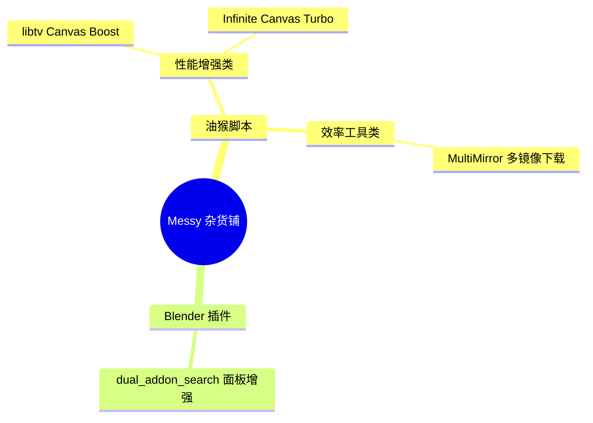

# 🛠️ Messy Toolbox | 杂货铺

---

## 📌 项目概览

---

## 🦾 油猴脚本合集

### 🎯 画布性能增强系列

#### 🚀 libtv Canvas Boost

    

> [!TIP]
> 针对 libtv 场景深度优化的画布渲染加速脚本，优化重绘逻辑、降低内存占用，大幅提升高分辨率画布下的平移、缩放、绘制操作流畅度，显著减少卡顿掉帧。

#### 版本历史

| 版本 | 亮点 |
|------|------|
| **v1.9.10** | 提示词模板重构：内联表单弹窗 + 分类徽章 + 查看弹窗 + 始终可见操作按钮 · 列表布局重做 |
| **v1.9.9** | AI 增强重构：预设策略(润色/扩写/缩写/翻译) + 自定义 system prompt + 结果对比区 · 多账号切换（Cookie + localStorage 快照） |
| **v1.9.8** | 首次使用引导面板 · 设置面板新增「帮助/重新显示引导」按钮 |
| v1.9.7 | 面板 CSS 主题跟随迁移完成 · 主题预设扩充至 29 种（含高对比度） |
| v1.9.6 | 按钮 5 种样式 + 右键循环切换 + localStorage 持久化 |
| v1.9.5 | 引入按钮样式系统 · 主题预设补充（+9 dark +4 light） |
| v1.9.4 | OMO 配置修复（子代理模型统一） |

 

#### ⚡ Infinite Canvas Turbo

    

> [!TIP]
> 无限画布场景专属性能涡轮优化，针对大画布、多元素场景做了分层渲染与视口裁剪优化，操作跟手度大幅提升。

---

### ⬇️ 下载工具系列

#### 🌐 MultiMirror Download (HuggingFace + ComfyUI)

    

> [!IMPORTANT]
> 彻底解决 HuggingFace、ComfyUI 生态模型下载难题。自动识别页面模型文件，一键匹配国内多镜像加速源，支持多线程下载、断点续传，大幅提升大模型下载速度与成功率。

> [!CAUTION]
> 请确保下载的模型符合对应开源许可协议，仅用于个人学习与合法用途。

---

## 🧊 Blender 插件合集

个人开发的 Blender 效率向小插件，针对性优化日常创作流程。

🔍 dual_addon_search 插件设置面板增强

#### ✨ 核心特性

- 重构插件搜索与筛选逻辑，支持关键词模糊匹配
- 双栏布局大幅提升设置面板浏览与配置效率
- 一键快速定位插件配置项与帮助文档

> [!NOTE]
> 适配 Blender 3.x ~ 4.x 全系列正式版本，开箱即用，无额外依赖。

---

## 🛠️ 技术栈

---

**⭐ 觉得有用欢迎点个 Star 支持一下**

