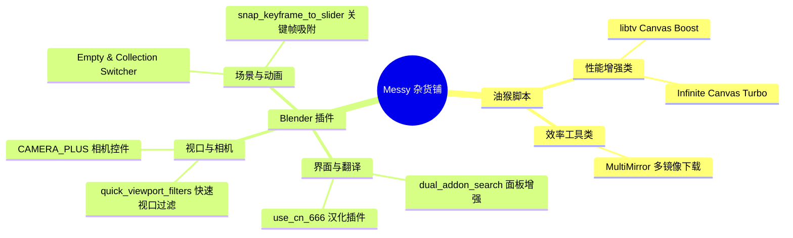

# 🛠️ Messy Toolbox | 杂货铺

---

## 📌 项目概览

```mermaid
mindmap
  root((Messy 杂货铺))
    油猴脚本
      性能增强类
        libtv Canvas Boost
        Infinite Canvas Turbo
      效率工具类
        MultiMirror 多镜像下载
    Blender 插件
      界面与翻译
        dual_addon_search 面板增强
        use_cn_666 汉化插件
      视口与相机
        quick_viewport_filters 快速视口过滤
        CAMERA_PLUS 相机控件
      场景与动画
        Empty & Collection Switcher
        snap_keyframe_to_slider 关键帧吸附
```

---

## 🦾 油猴脚本合集

### 🎯 画布性能增强系列

#### 🚀 libtv Canvas Boost

    

> [!TIP]
> 针对 libtv 场景深度优化的画布渲染加速脚本，优化重绘逻辑、降低内存占用，大幅提升高分辨率画布下的平移、缩放、绘制操作流畅度，显著减少卡顿掉帧。

当前版本 **v1.10.7** · 完整版本历史见 `libtv-boost/perf-script-dev.md`

#### ⚡ Infinite Canvas Turbo

    

> [!TIP]
> 无限画布场景专属性能涡轮优化，针对大画布、多元素场景做了分层渲染与视口裁剪优化，操作跟手度大幅提升。

---

### ⬇️ 下载工具系列

#### 🌐 MultiMirror Download (HuggingFace + ComfyUI) v1.0.4

    

> [!IMPORTANT]
> 彻底解决 HuggingFace、ComfyUI 生态模型下载难题。自动识别页面模型文件，一键匹配国内多镜像加速源，支持多线程下载、断点续传，大幅提升大模型下载速度与成功率。

> [!CAUTION]
> 请确保下载的模型符合对应开源许可协议，仅用于个人学习与合法用途。

---

## 🧊 Blender 插件合集

个人维护的 Blender 效率工具集，部分为原创开发，部分为修复兼容的魔改版本，针对性优化日常建模与动画工作流。

🔍 dual_addon_search — 插件设置面板增强

> 重构插件搜索与筛选逻辑，支持关键词模糊匹配；双栏布局大幅提升设置面板浏览与配置效率；一键快速定位插件配置项与帮助文档。

适配 Blender 3.x ~ 4.x，开箱即用，无额外依赖。

🌏 use_cn_666 — Blender 汉化插件（个人魔改）

> 基于社区汉化项目精调，补全缺失词条，优化翻译准确性，同步适配 Blender 最新版本 API 变更，让中文界面体验更完整流畅。

👁️ quick_viewport_filters — 快速视口过滤

> 一键切换视口显示过滤——灯光,网格,空物体，在建模与审阅之间自由跳转，减少菜单层级操作，专注创作本身。

📷 CAMERA_PLUS — 增强型相机控件

> 提供更直观的相机操控方式与视觉辅助。因原作者已停更，个人修复了与 Blender 最新版本的兼容性问题，延续插件生命周期。

🔗 Empty & Collection Switcher — 集合与父子级快速转换

> 在空对象与集合之间快速转换层级关系，灵活调整场景父子结构，尤其适合复杂装配与多层级场景的高效组织。

⏱️ snap_keyframe_to_slider — 关键帧吸附到时间线

> 将选中关键帧对齐到时间线当前帧位置，精确控制动画节奏，告别逐帧拖拽的手动对位，提升动画调整效率。

---

## 🛠️ 技术栈

- **油猴脚本**：JavaScript（Tampermonkey / ScriptCat），React Flow DOM 操作
- **Blender 插件**：Python（bl_info / blender_manifest.toml 双轨，兼容 4.2+ 扩展平台）
- **构建**：`node build.js`（libtv-boost）· `python build.py`（dual_addon_search 发布脚本）

---

**⭐ 觉得有用欢迎点个 Star 支持一下**

